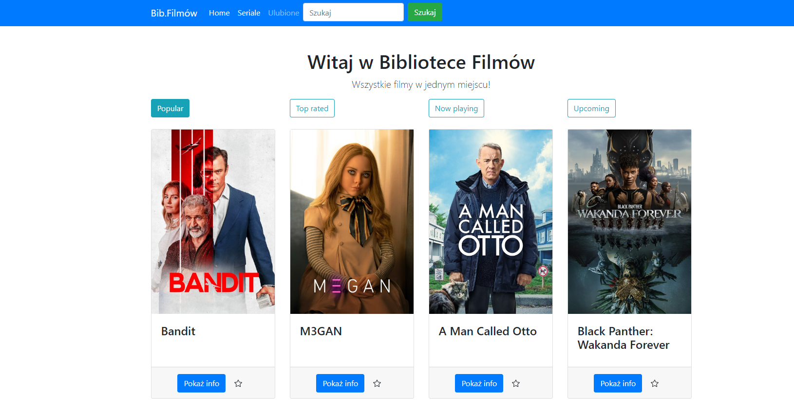

# Movies library - Python, Flask

A movie library made with Flask using The Movie Database API.

You can discover:
- the most popular movies 
- top rated movies
- upcoming movies
- movies now at the cinema

You can mark a movie as favorite by tapping a star icon.



## Installation

1. The first thing to do is to clone the repository:
    ```
    git clone https://github.com/matt064/movies_catalogue.git
    ```
2. Create a virtual environment to install dependencies in and activate it:
    ```
    python -m venv "path_to_catalog"'

    venv\Scripts\activate'
    ```

3. Then install the dependencies:
    ```
    (venv)pip install -r requirements
    ```

## Start app
    py main.py

## Known issues
This project is till ongoing. The game still needs many improvements. This is coming soon.
